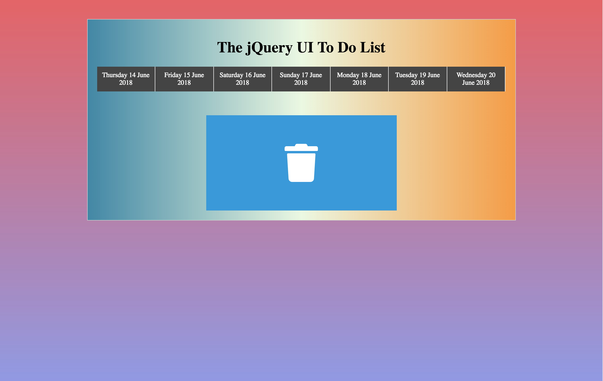
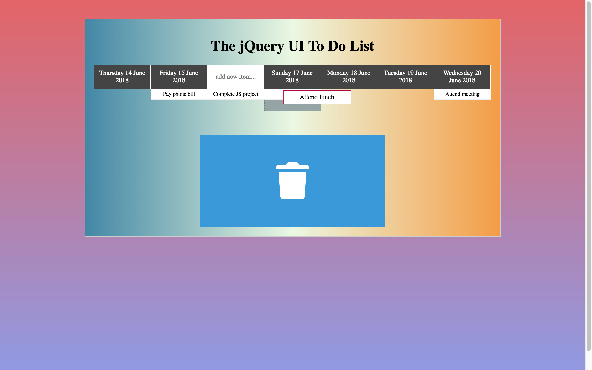

# jQuery-UI-TO-DO-LIST
A dynamic todo list to add, sort, drag and drop todo's

## Prerequisites
Yarn or npm

## Getting Started
Download the files, run npm or yarn install, it will install the dependencies. Once dependencies are installed run gulp watch to start browserify,
you can then make changes to files in src and see the compiled code in dist files

## Screenshots
 

## How to Use?
Hover on the dates, you will get a textbox to enter the todo's, enter the todo's, todo's are shown below the dates, you can drag those
todo's to other dates and even sort the todo's between themselves. You can drag the todo and drop it in trash when you no longer need to save them.

## Built With
  - [Gulp.js](https://gulpjs.com/) - The task manager
  - [Yarn](https://yarnpkg.com/en/) - The package manager
  - [Webpack](https://webpack.js.org/) - The module bundler
  - [Babel](https://webpack.js.org/) - The compiler to write latest JavaScript
